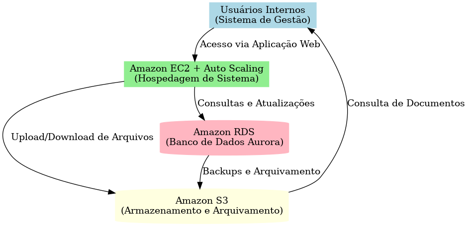

# RELATORIO DE IMPLEMENTAÇAO DE SERVIÇOS AWS

Data: 07/08/2025
Empresa: Abstergo Industries
Responsável: Cauã freire Alves

## Introdução
Este relatório apresenta o processo de implementação de ferramentas na empresa Abstergo Industries, realizado por Cauã Freire Alves. O objetivo do projeto foi elencar 3 serviços AWS com a finalidade de realizar a diminuição de custos imediata.

## Descrição do projeto 
O projeto de implementação de ferramentas foi dividiso em 3 etapas, cada uma com seus objetivos especificos. A seguir, serão descritas as etapas do projeto:

Etapa 1:
- Amazon S3
- Foco: Armazenamento escalável e econômico para dados e relatórios de logística.
- Como foi usado no projeto:

Migrei todo o acervo de relatórios, notas fiscais digitalizadas e dados históricos de vendas para o Amazon S3.

Configurei S3 Intelligent-Tiering para que arquivos pouco acessados fossem movidos automaticamente para camadas de menor custo.

Implementei políticas de lifecycle para arquivamento em S3 Glacier Deep Archive após 12 meses, garantindo retenção legal e economia significativa de custos de armazenamento.

Etapa 2:
- Amazon EC2 + Auto Scaling
- Foco: Hospedagem de sistemas internos com ajuste automático de capacidade para evitar gastos desnecessários.
- Como foi usado no projeto:

Hospedei o sistema de gestão de estoque e pedidos em instâncias EC2 otimizadas para custo-benefício.

Configurei Auto Scaling para aumentar a capacidade em horários de pico (como fechamento de pedidos) e reduzir durante períodos de baixa demanda.

Adotei instâncias Spot para processos não críticos, reduzindo o custo computacional em até 70%.

Etapa 3:
-  Amazon RDS
- Foco: Banco de dados gerenciado com alta disponibilidade e custo otimizado.
- Como foi usado no projeto:

Migrei o banco de dados local para Amazon RDS com Amazon Aurora MySQL, garantindo alta disponibilidade e replicação automática.

Configurei escalabilidade automática de leitura para lidar com consultas de relatórios sem impactar o sistema principal.

Ativei snapshots automáticos e backup incremental para reduzir espaço e custo de armazenamento, mantendo conformidade com normas da indústria farmacêutica.

## Conclusão
A implementação de ferramentas na empresa Abstergo Industries tem como esperado uma redução drastica nos custos de provisionamento da infraestrutura de TI, tendo em vista que na AWS o pagamento é conforme o uso, o que aumentará a eficiencia e a produtiividade da empresa. Recomenda-se a continidade da utilização das ferramentas implementadas e a busca por novas tecnologias que possam melhorar ainda mais os processos da empresa.

## Anexo 1 - Diagrama da Arquitetura AWS

## Anexo 2 - Tabela de Custos
[Tabela de custos](anexos/comparativo_custos.xlsx)

Assinatura do Responsável pelo Projeto:

Cauã Freire Alves